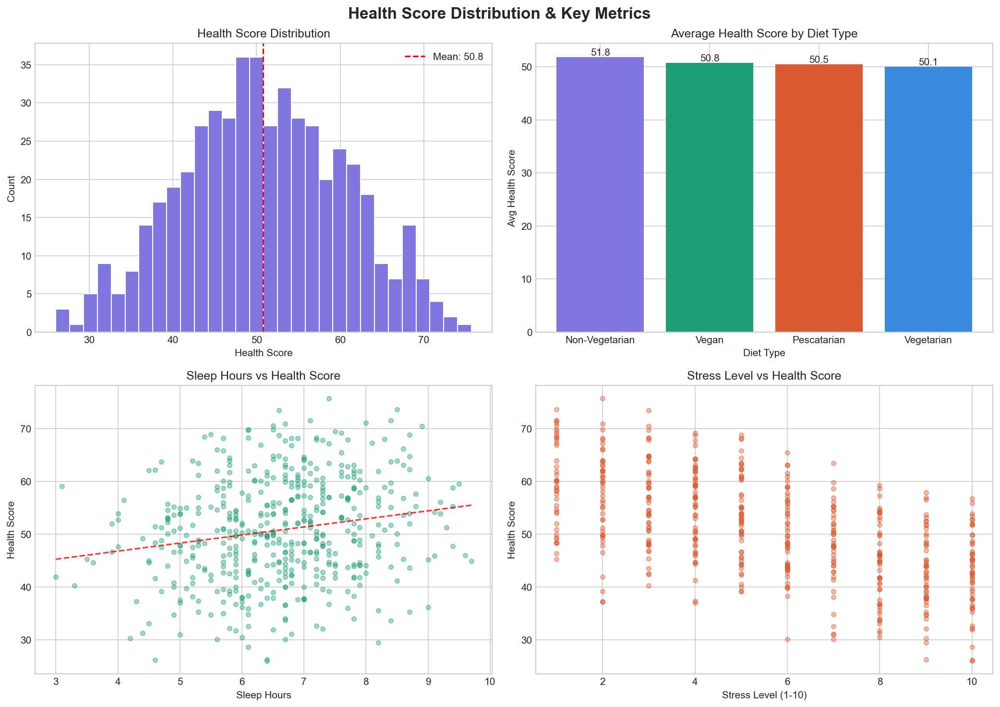
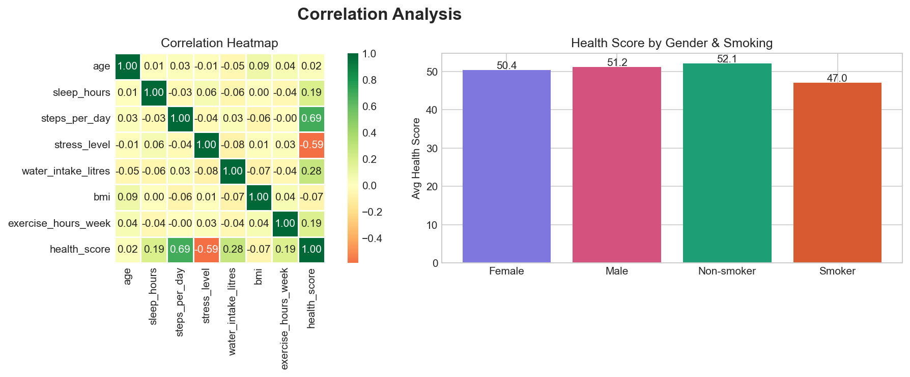

# Health & Lifestyle Analytics Dashboard
### End-to-End Data Analytics Project | Python · SQL · Gen AI · Power BI · Streamlit


---

## Live Demo
**https://health-analytics-dashboard-h7fzyk2j7hpwcfcpfe3kr4.streamlit.app/
** Click the link for dashboard

---

## Project Overview

A full end-to-end data analytics project that analyses health and lifestyle
patterns across 500 individuals to uncover actionable insights about sleep,
stress, physical activity, diet, and overall health outcomes.

This project was built to demonstrate real-world data analytics skills
including data engineering, exploratory data analysis, statistical testing,
SQL querying, Gen AI narrative generation, and interactive dashboard
development — all without a computer science background.

---

## Key Findings

| Finding | Insight |
|---|---|
| Top health predictor | Steps per day (0.69 correlation) |
| Sleep impact | 7+ hrs sleep = 3.1 point higher health score (p < 0.05) |
| Stress impact | High stress = 13.2 points lower health score |
| Smoking impact | Smokers score 5.1 points below non-smokers |
| At-risk population | 68 people (13.6%) scored below the 40-point threshold |

---

## Dashboard Pages

### 1. Overview Dashboard
- 4 live KPI metric cards (health score, at-risk count, steps, sleep)
- Health score distribution with risk threshold line
- Health score by diet type comparison
- Sleep vs health score scatter plot with trend line
- Top health factors correlation bar chart
- Interactive sidebar filters (age, diet, gender)

### 2. Deep Analysis
- Full correlation heatmap across all variables
- A/B test — sleep impact with t-test and p-value
- SQL query explorer with 4 pre-built queries

### 3. AI Insights
- Auto-generated executive health report (Gen AI narrative engine)
- Key findings cards with real data values
- Downloadable AI report

### 4. Personal Health Check
- Enter your own health profile
- Get an estimated health score out of 100
- Receive personalised AI recommendations
- Compare your score against the population average

---

## Tech Stack

| Tool | Purpose |
|---|---|
| Python (Pandas, NumPy) | Data generation, cleaning, EDA |
| Matplotlib, Seaborn | Data visualisation (10+ charts) |
| SQLite + SQL | Database storage and querying |
| SciPy | Statistical analysis and A/B testing |
| Rule-Based NLP (Gen AI) | Automated insight narrative generation |
| Streamlit | Interactive web dashboard |
| Git + GitHub | Version control |

---

## Project Structure

health-analytics-dashboard/
│
├── data/
│   ├── health_data.csv          # Generated dataset (500 rows, 12 columns)
│   └── health_analytics.db      # SQLite database with 2 tables
│
├── scripts/
│   ├── generate_data.py         # Dataset generation + SQL pipeline
│   ├── eda_analysis.py          # EDA, visualisations, A/B test, SQL queries
│   └── ai_insights.py           # Gen AI narrative + recommendation engine
│
├── dashboards/
│   └── app.py                   # Streamlit web application (4 pages)
│
├── reports/
│   ├── ai_health_report.txt     # AI-generated executive report
│   └── kpis.json                # Extracted KPIs for dashboard
│
├── screenshots/
│   ├── health_overview.png      # Chart 1
│   └── correlation_analysis.png # Chart 2
│
├── requirements.txt
└── README.md

---

## How to Run Locally
```bash
# 1. Clone the repository
git clone https://github.com/khushi-barange/health-analytics-dashboard.git
cd health-analytics-dashboard

# 2. Create virtual environment
python -m venv venv
venv\Scripts\activate        # Windows
source venv/bin/activate     # Mac/Linux

# 3. Install dependencies
pip install -r requirements.txt

# 4. Generate the dataset
python scripts/generate_data.py

# 5. Run EDA analysis
python scripts/eda_analysis.py

# 6. Generate AI insights
python scripts/ai_insights.py

# 7. Launch the dashboard
streamlit run dashboards/app.py
```

---

## Screenshots

### Overview Dashboard


### Correlation Analysis


---

## About the Author

**Khushi Barange** — Data Analyst  
MSc Biotechnology | Google Data Analytics Certified | Google Cloud Gen AI Certified

Transitioning from life sciences research to data analytics, with hands-on
experience in healthcare, ESG, and retail analytics domains.

[LinkedIn](https://www.linkedin.com/in/khushi-barange-b9161830a/) |
[GitHub](https://github.com/khushi-barange)
